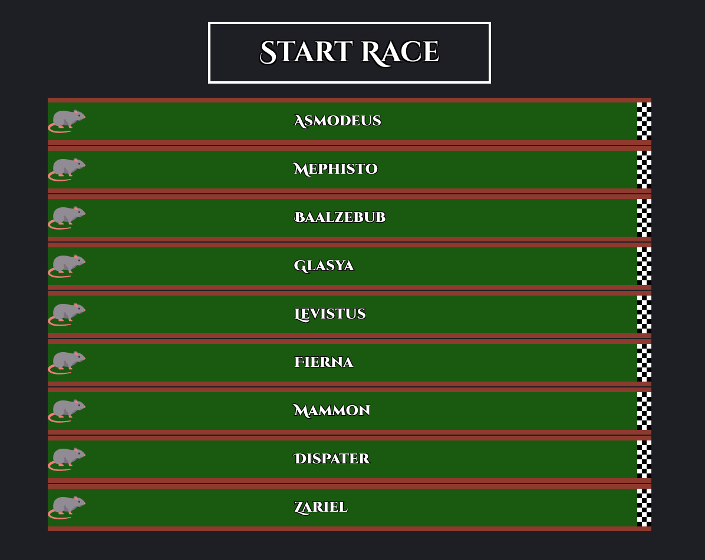
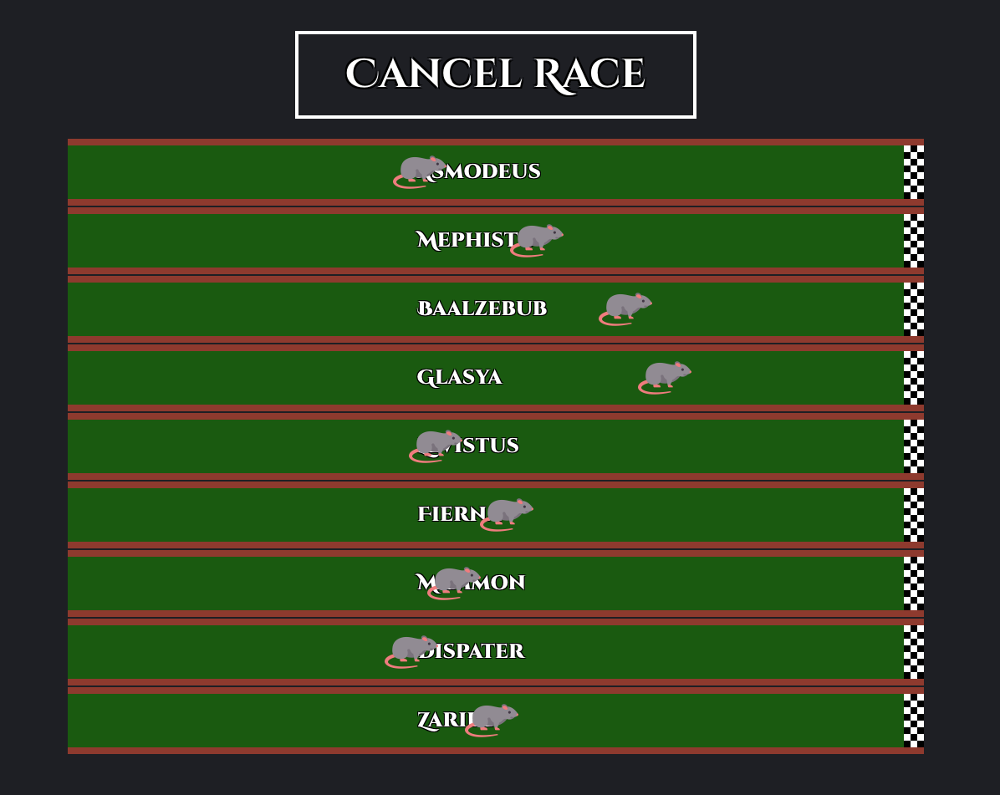
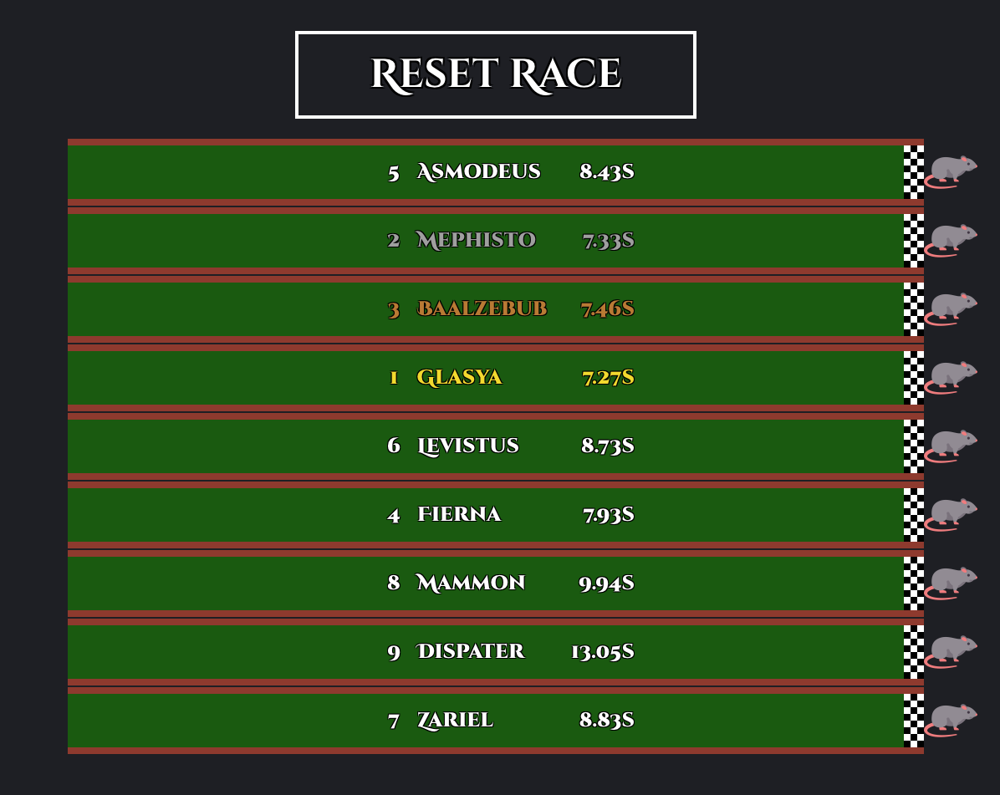

# The Stygian Gambit - Rat Race

The Stygian Gambit is a Dungeons and Dragons Adventure from the official Book **Keys from the Golden Vault**.

This project visualizes the rat racing table.

## Winning Chances

Not all rats are equally fast. This gives the DM the ability allow players checks to get more info about the rats,
so they can increase their chances of winning.

### Fast Rats
`Average Placement: 4.4`

- Glasya
- Fierna
- Zariel

**Placement chances (roughly):**
- **1**: 15.8%
- **2**: 14.1%
- **3**: 13%
- **4**: 12%
- **5**: 11.2%
- **6**: 10.3%
- **7**: 9.3%
- **8**: 8%
- **9**: 6.3%

### Average Rats
`Average Placement: 5`

- Mephisto
- Levistus
- Mammon

**Placement chances (roughly):**
- **1**: 1/9
- **2**: 1/9
- **3**: 1/9
- **4**: 1/9
- **5**: 1/9
- **6**: 1/9
- **7**: 1/9
- **8**: 1/9
- **9**: 1/9

### Slow Rats
`Average Placement: 5.6`

- Asmodeus
- Baalzebub
- Dispater

**Placement chances (roughly):**

- **1**: 6.3%
- **2**: 8%
- **3**: 9.3%
- **4**: 10.3%
- **5**: 11.2%
- **6**: 12%
- **7**: 13%
- **8**: 14.1%
- **9**: 15.8%

## Math
Every second each rat rolls a D20. A rat has finished the race when their rolled total reaches 100.
Each rat also has a bonus applied to their roll. This bonus of 2 (fast), 1 (average), 0 (slow) is
multiplied by a random value between 0 and 1 and then added to their roll.

### Example 1
- Fierna rolls a 9
- The bonus is 2
- The random value is 0.25
- The total roll is 9 + 0.25 = 9.25

### Example 2
- Mephisto rolls a 16
- The bonus is 1
- The random value is 1
- The total roll is 16 + 1 = 17
